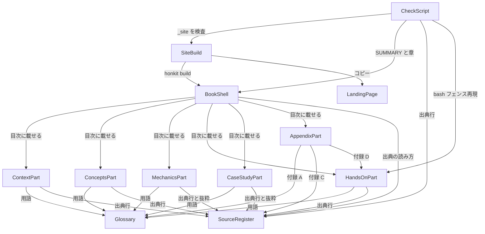

# Components — AI-DLC v2 教材（first 版）

入力: `../requirements-analysis/requirements.md`（`requirements`: FR1〜FR8、NFR1〜NFR8、OQ1〜OQ6）、`../practices-discovery/team-practices.md`（`team-practices`: 章テンプレート、出典 4 名前空間、リンク規約、`check-first.mjs`）、`domain-design-questions.md`（Q1〜Q5 の代理回答）。教材にはアプリケーションコードが無いため、「コンポーネント」は「私たちが書く、独立した責務を持つまとまり」と読み替える（Q1）。配置（どの Unit にまとめるか）は Units Generation で決める。

## Component Catalogue

```yaml
components:
  - name: BookShell
    summary: HonKit の骨格（README・SUMMARY・book.json・.bookignore）と章の台帳
    behaviour: >
      SUMMARY.md を唯一の目次とし、部と章の番号・タイトル・ファイルパスを保持する。章ファイルを追加したら同じコミットで SUMMARY.md に載せる。README は対象読者・前提・2.8.2 固定・claude 版との関係・出典の読み方・原典 URL を持つ。.bookignore は .claude と aidlc を除外する。
    responsibilities:
      - README.md（はじめに）の内容（FR1.1）
      - SUMMARY.md と book.json（language ja）の形（FR1.2）
      - 部と章の台帳（番号・タイトル・パス・対応する FR）
    depends_on:
      - component: ContextPart
        interaction: 第 1 部の章を目次に載せる
        style: sync
      - component: ConceptsPart
        interaction: 第 2 部の章を目次に載せる
        style: sync
      - component: MechanicsPart
        interaction: 第 3 部の章を目次に載せる
        style: sync
      - component: HandsOnPart
        interaction: 第 4 部の章を目次に載せる
        style: sync
      - component: CaseStudyPart
        interaction: 第 5 部の章を目次に載せる
        style: sync
      - component: AppendixPart
        interaction: 付録の章を目次に載せる
        style: sync
      - component: SourceRegister
        interaction: README の「出典の読み方」に名前空間と GitHub URL の組み立て方を書く
        style: sync
    dependents:
      - component: SiteBuild
        interaction: honkit build の入力
      - component: CheckScript
        interaction: SUMMARY.md と docs/**/*.md の一致検査
    external_dependencies: []
    entities:
      - name: Part
        identifier: number
        attributes: [number, title, directory, order]
      - name: Chapter
        identifier: path
        attributes: [path, number, title, partNumber, frId, learningObjectives]
        references:
          - entity: Part
            owned_by: BookShell
            relationship: 各 Chapter はちょうど 1 つの Part に属する

  - name: ContextPart
    summary: 第 1 部「読者の現在地」（1 章）
    behaviour: >
      読者の日常、スケールしない理由、方法論の意味、本書の読み方、AI 開発の歴史と種類の要点、次に読むものへの導線を 1 章で扱う。歴史の詳細は claude 版 第 1 部へ .html リンクで送る。
    responsibilities:
      - 1.1 の本文（FR2.1）と導線（FR8.1）
    depends_on:
      - component: Glossary
        interaction: 初出の用語を対訳表に従って表記する
        style: sync
      - component: SourceRegister
        interaction: 章末の出典行を書式どおりに書く
        style: sync
    dependents:
      - component: BookShell
        interaction: 目次に載る
    external_dependencies:
      - name: claude 版（../claude/）
        kind: other
        purpose: 歴史・比較・チーム導入の詳細へのリンク先（文章は再利用しない）
    entities: []

  - name: ConceptsPart
    summary: 第 2 部「AI-DLC の概念」（2 章）
    behaviour: >
      AI-DLC の位置づけ（原典・実装・v2/v1 の呼称・リポジトリの歩み）と、2.8.2 が定義する用語を扱う。v1 は断定せず claude 版へリンクする。原典は 00-introduction.md 経由で引く。
    responsibilities:
      - 2.1 の本文（FR3.1）
      - 2.2 の本文（FR3.2）
    depends_on:
      - component: Glossary
        interaction: 用語の定義と訳語の初出を担う
        style: sync
      - component: SourceRegister
        interaction: 章末の出典行と原典の引き方
        style: sync
    dependents:
      - component: BookShell
        interaction: 目次に載る
    external_dependencies:
      - name: AWS AI-DLC ブログ（原典）
        kind: other
        purpose: 方法論の原典。URL は 2.1 本文と付録 C にのみ書く
    entities: []

  - name: MechanicsPart
    summary: 第 3 部「v2 の仕組み」（8 章）
    behaviour: >
      インストールと設定、エンジンとコンダクター、フェーズとステージ、スコープとコンポーザー、エージェントと委譲、ゲート・在席・監査、ルール・学習ループ・センサー、Construction の進め方を各 1 章で扱う。概念と手順の説明に、本ワークフローの記録からの短い抜粋を添える。TypeScript のコードは引用しない。
    responsibilities:
      - 3.1〜3.8 の本文（FR4.1〜FR4.8）
    depends_on:
      - component: Glossary
        interaction: 用語の表記
        style: sync
      - component: SourceRegister
        interaction: 出典行と記録抜粋の形式
        style: sync
    dependents:
      - component: BookShell
        interaction: 目次に載る
    external_dependencies: []
    entities: []

  - name: HandsOnPart
    summary: 第 4 部「ハンズオン」（2 章）
    behaviour: >
      環境準備と最初のワークフローを、読者がそのまま実行できる bash フェンスの手順で書く。手順は build-and-test でクリーン環境により再現される（NFR1）。Bedrock 既定と他プロバイダの両方を書く。つまずきポイントを章内の任意節に置く。
    responsibilities:
      - 4.1 の本文と手順（FR5.1）
      - 4.2 の本文と手順（FR5.2）
      - 手順の一つ一つ（HandsOnStep）とその期待出力
    depends_on:
      - component: Glossary
        interaction: 用語の表記
        style: sync
      - component: SourceRegister
        interaction: 出典行の形式
        style: sync
    dependents:
      - component: BookShell
        interaction: 目次に載る
      - component: AppendixPart
        interaction: つまずきポイントの横断再掲（付録 D）
      - component: CheckScript
        interaction: bash フェンスの抽出と再現検査（NFR1）
    external_dependencies:
      - name: aidlc 2.8.2 リリース（install.sh）
        kind: third-party-api
        purpose: 読者が実行するインストーラ。版は 2.8.2 に固定
      - name: Claude Code
        kind: other
        purpose: 読者が /aidlc を実行するハーネス
    entities:
      - name: HandsOnStep
        identifier: stepId
        attributes: [stepId, chapterPath, command, expectedOutput, verifiedIn]
        references:
          - entity: Chapter
            owned_by: BookShell
            relationship: 各 HandsOnStep はちょうど 1 つの Chapter に属する

  - name: CaseStudyPart
    summary: 第 5 部「ケーススタディ — 本書はどう作られたか」（3 章）
    behaviour: >
      compose とスコープ、質問と代理回答、レビューと差し戻し、ハブ&スポーク、記録の読み方と限界を、記録ファイルからの抜粋と [record] 出典で書く。マスキング規約に従い、各節末に「読者が自分のワークフローで同じものを見る場所」を置く。
    responsibilities:
      - 5.1〜5.3 の本文（FR6.1〜FR6.3）
      - 抜粋する記録の選定（形式は SourceRegister に従う）
    depends_on:
      - component: Glossary
        interaction: 用語の表記
        style: sync
      - component: SourceRegister
        interaction: 出典行と記録抜粋（RecordExcerpt）の形式とマスキング
        style: sync
    dependents:
      - component: BookShell
        interaction: 目次に載る
    external_dependencies: []
    entities: []

  - name: AppendixPart
    summary: 付録 A〜D（用語集・コマンド早見・出典一覧・つまずきポイント）
    behaviour: >
      用語集は Glossary の Term を表に描く。コマンド早見は aidlc --help / aidlc engine --help と docs/guide/12-cli-commands.md で確認したものだけを載せる。出典一覧は SourceRegister の全 SourceEntry を集約し GitHub URL の組み立て方を示す。つまずきポイントは HandsOnPart の節と本ワークフローの事象を横断再掲する。下限文字数は無い（NFR4 (b)）。
    responsibilities:
      - 付録 A〜D の本文（FR7.1〜FR7.4）
      - コマンド早見の各行（CommandEntry）とつまずきポイントの各行（TroubleshootingEntry）
    depends_on:
      - component: Glossary
        interaction: Term を用語集として描く（付録 A）
        style: sync
      - component: SourceRegister
        interaction: 全章の SourceEntry を一覧にする（付録 C）
        style: sync
      - component: HandsOnPart
        interaction: つまずきポイントを再掲する（付録 D）
        style: sync
    dependents:
      - component: BookShell
        interaction: 目次に載る
    external_dependencies: []
    entities:
      - name: CommandEntry
        identifier: command
        attributes: [command, purpose, verifiedBy, firstChapter]
      - name: TroubleshootingEntry
        identifier: symptom
        attributes: [symptom, cause, fix, sourceChapter]

  - name: Glossary
    summary: 対訳表（英語トークン → 表記区分 → 日本語 → 初出章）
    behaviour: >
      用語を三分類する: コードスパンで英語のまま、固有名詞として英語のまま（初出で一文の説明）、1 語 1 訳の日本語。すべての部がこの表に従い、執筆で新語が出たら表に足す。付録 A はこの表を描いたもの。
    responsibilities:
      - 対訳表の内容と分類規則（Q3）
      - 訳語の揺れの禁止（NFR7）
    depends_on: []
    dependents:
      - component: ContextPart
        interaction: 用語の表記
      - component: ConceptsPart
        interaction: 用語の定義と初出
      - component: MechanicsPart
        interaction: 用語の表記
      - component: HandsOnPart
        interaction: 用語の表記
      - component: CaseStudyPart
        interaction: 用語の表記
      - component: AppendixPart
        interaction: 付録 A として描く
    external_dependencies: []
    entities:
      - name: Term
        identifier: englishToken
        attributes: [englishToken, category, japanese, firstChapter, definitionSource]

  - name: SourceRegister
    summary: 出典行と記録抜粋の仕組み（書式・名前空間・検査・一覧）
    behaviour: >
      出典行は「- [<名前空間>] <パス> <位置> — <主張>」、名前空間は [2.8.2] / [runtime] / [record] / [推定] の 4 つ、位置は見出し名かシンボル名、パスはコードスパン。[2.8.2] はタグ v2.8.2（commit 355903d）の木。原典（AWS ブログ）は [2.8.2] docs/guide/00-introduction.md § What is AI-DLC? 経由で引く。記録抜粋は記録ファイルと範囲を明示し、マスキング規約を適用する。
    responsibilities:
      - 出典行と抜粋の書式（SourceEntry、RecordExcerpt）
      - 名前空間 4 種と食い違いの優先順位 4 段
      - 付録 C の一覧の元データ
    depends_on: []
    dependents:
      - component: BookShell
        interaction: README の「出典の読み方」
      - component: ContextPart
        interaction: 出典行
      - component: ConceptsPart
        interaction: 出典行と原典の引き方
      - component: MechanicsPart
        interaction: 出典行と抜粋
      - component: HandsOnPart
        interaction: 出典行
      - component: CaseStudyPart
        interaction: 出典行と抜粋
      - component: AppendixPart
        interaction: 付録 C の一覧
      - component: CheckScript
        interaction: 出典行の書式と参照先の実在の検査
    external_dependencies:
      - name: awslabs/aidlc-workflows タグ v2.8.2
        kind: other
        purpose: "[2.8.2] の照合先（git cat-file -e v2.8.2:<path>）"
    entities:
      - name: SourceEntry
        identifier: entryId
        attributes: [entryId, chapterPath, namespace, path, position, claim]
        references:
          - entity: Chapter
            owned_by: BookShell
            relationship: 各 SourceEntry はちょうど 1 つの Chapter の出典節に属する
      - name: RecordExcerpt
        identifier: excerptId
        attributes: [excerptId, chapterPath, recordPath, range, masked]
        references:
          - entity: Chapter
            owned_by: BookShell
            relationship: 各 RecordExcerpt はちょうど 1 つの Chapter に置かれる

  - name: CheckScript
    summary: 親リポジトリの scripts/check-first.mjs と npm run check:first
    behaviour: >
      Node 22 標準 API のみ。blocking: _site/index.html と _site/first/ の内部リンク（.md 残存 0、参照先の実在）、SUMMARY.md と docs/**/*.md の一致、章テンプレートの必須節、フェンス言語の許容集合、mermaid 禁止、引用ラベル集合、ルート絶対パス禁止、出典行の書式と名前空間と参照先の実在、付録見出し `# <A〜D>. タイトル`、文字数（NFR4）。advisory: _site/claude/ の内部リンク、外部 URL。ハンズオン再現（NFR1）は bash フェンスを抽出して一時ディレクトリで実行する別モード。
    responsibilities:
      - 検査規則（CheckRule）の定義と実装
      - 終了コード（blocking 違反で非 0）
    depends_on:
      - component: SiteBuild
        interaction: _site/ の HTML を入力にする
        style: sync
      - component: BookShell
        interaction: SUMMARY.md と章ファイルの一致を検査する
        style: sync
      - component: SourceRegister
        interaction: 出典行の書式と参照先の実在を検査する
        style: sync
      - component: HandsOnPart
        interaction: bash フェンスを抽出して再現する（NFR1）
        style: sync
    dependents: []
    external_dependencies:
      - name: Node.js 22
        kind: other
        purpose: 実行環境（依存パッケージは追加しない）
      - name: git
        kind: other
        purpose: タグ v2.8.2 の木に対する出典パスの実在確認
      - name: curl
        kind: other
        purpose: 外部 URL と公開 URL の到達性（advisory / smoke）
    entities:
      - name: CheckRule
        identifier: ruleId
        attributes: [ruleId, severity, target, description]

  - name: SiteBuild
    summary: 既存の scripts/build-site.mjs と .github/workflows/deploy.yml（変更は 2 点まで）
    behaviour: >
      claude/ と first/ を honkit で _site/claude/ と _site/first/ にビルドし、site/ をコピーして _site/ を組み立てる。deploy.yml は PR で build ジョブ、main への push で deploy。変更は npm run check:first の 1 ステップ追加と permissions のジョブ単位化のみ。
    responsibilities:
      - _site/first/ の生成（FR1.3）
      - 公開経路（既存ワークフロー）
    depends_on:
      - component: BookShell
        interaction: first/ を honkit build の入力にする
        style: sync
      - component: LandingPage
        interaction: site/ を _site/ にコピーする
        style: sync
    dependents:
      - component: CheckScript
        interaction: ビルド出力の検査
    external_dependencies:
      - name: honkit 6.2.2
        kind: other
        purpose: Markdown → HTML
      - name: GitHub Actions
        kind: other
        purpose: PR のビルドと main のデプロイ
      - name: GitHub Pages
        kind: other
        purpose: 公開先（/first/）
    entities:
      - name: BuildTarget
        identifier: outputDir
        attributes: [outputDir, sourceDir, publishedPath]

  - name: LandingPage
    summary: site/index.html の first 版概要文（deployment-execution で更新）
    behaviour: >
      2 冊の概要と両版へのリンクを持つ既存ページ。本ワークフローで変えるのは first 版の概要文と、配布方式の転換点の記述（2.7.2 で install.sh 初出、2.8.0 系が最初の baseline）だけ。
    responsibilities:
      - first 版の概要文（FR1.3、scope-document「deployment-execution の一部」）
    depends_on: []
    dependents:
      - component: SiteBuild
        interaction: _site/ にコピーされる
    external_dependencies: []
    entities: []
```

## Component Diagram



テキスト版（同じ内容）:

```text
CheckScript --> SiteBuild --> BookShell --> {ContextPart, ConceptsPart, MechanicsPart,
                    |                        HandsOnPart, CaseStudyPart, AppendixPart}
                    +--> LandingPage              |            |
CheckScript --> BookShell, SourceRegister,        v            v
                HandsOnPart                   Glossary    SourceRegister
AppendixPart --> Glossary, SourceRegister, HandsOnPart
```

## Component Summary

| Component | Purpose | Depends On | Dependents | Entities Owned |
| --- | --- | --- | --- | --- |
| BookShell | 骨格と章の台帳 | 内容 6 部、SourceRegister | SiteBuild、CheckScript | Part、Chapter |
| ContextPart | 第 1 部（1 章） | Glossary、SourceRegister | BookShell | — |
| ConceptsPart | 第 2 部（2 章） | Glossary、SourceRegister | BookShell | — |
| MechanicsPart | 第 3 部（8 章） | Glossary、SourceRegister | BookShell | — |
| HandsOnPart | 第 4 部（2 章） | Glossary、SourceRegister | BookShell、AppendixPart、CheckScript | HandsOnStep |
| CaseStudyPart | 第 5 部（3 章） | Glossary、SourceRegister | BookShell | — |
| AppendixPart | 付録 A〜D | Glossary、SourceRegister、HandsOnPart | BookShell | CommandEntry、TroubleshootingEntry |
| Glossary | 対訳表 | — | 内容 6 部 | Term |
| SourceRegister | 出典と抜粋の仕組み | — | BookShell、内容 6 部、CheckScript | SourceEntry、RecordExcerpt |
| CheckScript | 検査スクリプト | SiteBuild、BookShell、SourceRegister、HandsOnPart | — | CheckRule |
| SiteBuild | ビルドと公開経路 | BookShell、LandingPage | CheckScript | BuildTarget |
| LandingPage | 概要文の更新 | — | SiteBuild | — |

## Entity Ownership

| Entity | Owning Component | Identifier | Attributes | References |
| --- | --- | --- | --- | --- |
| Part | BookShell | number | number, title, directory, order | — |
| Chapter | BookShell | path | path, number, title, partNumber, frId, learningObjectives | Part（各章は 1 つの部に属する） |
| HandsOnStep | HandsOnPart | stepId | stepId, chapterPath, command, expectedOutput, verifiedIn | Chapter |
| CommandEntry | AppendixPart | command | command, purpose, verifiedBy, firstChapter | — |
| TroubleshootingEntry | AppendixPart | symptom | symptom, cause, fix, sourceChapter | — |
| Term | Glossary | englishToken | englishToken, category, japanese, firstChapter, definitionSource | — |
| SourceEntry | SourceRegister | entryId | entryId, chapterPath, namespace, path, position, claim | Chapter |
| RecordExcerpt | SourceRegister | excerptId | excerptId, chapterPath, recordPath, range, masked | Chapter |
| CheckRule | CheckScript | ruleId | ruleId, severity, target, description | — |
| BuildTarget | SiteBuild | outputDir | outputDir, sourceDir, publishedPath | — |

## External Dependencies

| Component | Dependency | Kind | Purpose |
| --- | --- | --- | --- |
| ContextPart | claude 版（../claude/） | other | 詳細へのリンク先（文章は再利用しない） |
| ConceptsPart | AWS AI-DLC ブログ（原典） | other | 方法論の原典。URL は 2.1 と付録 C にのみ |
| HandsOnPart | aidlc 2.8.2 リリース（install.sh） | third-party-api | 読者が実行するインストーラ |
| HandsOnPart | Claude Code | other | 読者のハーネス |
| SourceRegister | awslabs/aidlc-workflows タグ v2.8.2 | other | `[2.8.2]` の照合先 |
| CheckScript | Node.js 22 / git / curl | other | 実行環境・タグの木・到達性 |
| SiteBuild | honkit 6.2.2 / GitHub Actions / GitHub Pages | other | ビルド・CI・公開 |

## Chapter Ledger（BookShell の Chapter 台帳、Q2）

| 章 | ファイル | FR | 部 |
| --- | --- | --- | --- |
| はじめに | `README.md` | FR1.1 | — |
| 1.1 あなたの AI 利用はどこにいるか | `docs/01-context/01-where-you-are.md` | FR2.1、FR8.1 | 第 1 部 |
| 2.1 AI-DLC とは何か | `docs/02-concepts/01-what-is-aidlc.md` | FR3.1 | 第 2 部 |
| 2.2 2.8.2 が定義する用語 | `docs/02-concepts/02-terms-in-2-8-2.md` | FR3.2 | 第 2 部 |
| 3.1 インストールと設定 | `docs/03-mechanics/01-install-and-config.md` | FR4.1 | 第 3 部 |
| 3.2 エンジンとコンダクター | `docs/03-mechanics/02-engine-and-conductor.md` | FR4.2 | 第 3 部 |
| 3.3 フェーズとステージ | `docs/03-mechanics/03-phases-and-stages.md` | FR4.3 | 第 3 部 |
| 3.4 スコープとコンポーザー | `docs/03-mechanics/04-scopes-and-composer.md` | FR4.4 | 第 3 部 |
| 3.5 エージェントと委譲 | `docs/03-mechanics/05-agents-and-delegation.md` | FR4.5 | 第 3 部 |
| 3.6 承認ゲート・人間の在席・監査ログ | `docs/03-mechanics/06-gates-presence-audit.md` | FR4.6 | 第 3 部 |
| 3.7 ルール・学習ループ・センサー | `docs/03-mechanics/07-rules-learning-sensors.md` | FR4.7 | 第 3 部 |
| 3.8 Construction の進め方 | `docs/03-mechanics/08-construction-flow.md` | FR4.8 | 第 3 部 |
| 4.1 環境準備 | `docs/04-handson/01-setup.md` | FR5.1 | 第 4 部 |
| 4.2 最初のワークフロー | `docs/04-handson/02-first-workflow.md` | FR5.2 | 第 4 部 |
| 5.1 計画 — compose とスコープ、質問と代理回答 | `docs/05-case-study/01-planning.md` | FR6.1 | 第 5 部 |
| 5.2 レビューと差し戻し、ハブ&スポーク | `docs/05-case-study/02-review-and-hub-spoke.md` | FR6.2 | 第 5 部 |
| 5.3 記録の読み方と限界 | `docs/05-case-study/03-reading-the-record.md` | FR6.3 | 第 5 部 |
| A. 用語集 | `docs/99-appendix/01-glossary.md` | FR7.1 | 付録 |
| B. コマンド早見 | `docs/99-appendix/02-commands.md` | FR7.2 | 付録 |
| C. 出典一覧 | `docs/99-appendix/03-sources.md` | FR7.3 | 付録 |
| D. つまずきポイント | `docs/99-appendix/04-troubleshooting.md` | FR7.4 | 付録 |

`SUMMARY.md` の形: `# 目次`、`* [はじめに](README.md)`、`## 第1部 読者の現在地` … `## 第5部 ケーススタディ`、`## 付録`、章は `* [N.M タイトル](docs/…)`、付録は `* [A. 用語集](docs/99-appendix/01-glossary.md)`。付録の章見出しは `# A. 用語集` の形で、`check-first.mjs` の許容集合に含める。

## Glossary Seed（Glossary の Term の初期値、Q3）

| 英語トークン | 区分 | 日本語表記 | 初出章 | 定義の出典 |
| --- | --- | --- | --- | --- |
| AI-DLC | 固有名詞 | AI-DLC（初出で「AI 駆動開発ライフサイクル」と説明） | 1.1 | `docs/guide/00-introduction.md § What is AI-DLC?` |
| HonKit / GitHub Pages / Claude Code / Amazon Bedrock | 固有名詞 | そのまま | README | — |
| Bolt | 固有名詞 | Bolt | 2.2 | `docs/guide/glossary.md`（Bolt） |
| Unit | 固有名詞 | Unit | 2.2 | `docs/guide/glossary.md`（Unit of Work） |
| Intent / Space | 固有名詞 | Intent / Space | 3.1 | `docs/guide/03-spaces-and-intents.md` |
| walking skeleton | 固有名詞 | walking skeleton（初出で「薄い一本通し」と説明） | 2.2 | `docs/guide/glossary.md` |
| Initialization / Ideation / Inception / Construction / Operation | 固有名詞 | そのまま | 2.2 | `.claude/knowledge/aidlc-shared/ai-dlc-principles.md § Five-Phase Structure` |
| stage / phase | 訳す | ステージ / フェーズ | 2.2 | `docs/guide/04-phases-and-stages.md` |
| scope / depth / test strategy | 訳す | スコープ / 深さ（Depth） / テスト戦略（Test Strategy） | 2.2 | `docs/guide/05-scopes-and-depth.md` |
| engine / conductor / directive | 訳す | エンジン / コンダクター / ディレクティブ | 3.2 | `docs/guide/00-introduction.md § How the Orchestrator Works` |
| approval gate / summary confirmation / questions file | 訳す | 承認ゲート / 要約確認 / 質問ファイル | 3.3 | `docs/reference/04-stage-protocol.md` |
| audit log / audit shard / human presence | 訳す | 監査ログ / 監査シャード / 人間の在席 | 3.6 | `docs/guide/10-state-and-audit.md` |
| sensor / learnings / rule / memory layers | 訳す | センサー / 学び / ルール / メモリ層 | 3.7 | `docs/guide/09-rules-and-the-learning-loop.md` |
| harness / reviewer / advisory / adversarial | 訳す | ハーネス / レビュアー / 助言型（advisory） / 対抗型（adversarial） | 3.5 | `docs/guide/06-agents.md` |
| lead agent / support agent / contribution / hub-and-spoke / mob | 訳す | リード / 支援エージェント / 寄稿 / ハブ&スポーク / mob 実行 | 3.5 | `docs/guide/glossary.md`（Mob execution） |
| ladder prompt / worktree / compose / composer | 訳す | ラダープロンプト / ワークツリー / compose / コンポーザー | 3.4、3.8 | `docs/guide/05-scopes-and-depth.md`、`docs/guide/glossary.md` |
| primary source / record / traceability | 訳す | 一次情報 / 記録 / トレーサビリティ | README | — |
| コマンド・フラグ・パス・slug・イベント名・状態フィールド・スコープ名・YAML キー・判定値・ディレクティブ種別 | コードスパン | 英語のまま | 各章 | — |

## Rationale

| Component | なぜ独立したまとまりか | Alternatives Rejected |
| --- | --- | --- |
| BookShell | 目次と設定は全章に先立ち、walking skeleton の中核。変更率が低く、検査（SUMMARY と章の一致）の対象 | 各部が自分の目次断片を持つ案（HonKit は単一 SUMMARY.md しか読まない） |
| ContextPart〜CaseStudyPart（5 部） | 部 = intent-backlog のプロト Unit = requirements の FR{n}。執筆順序（risk-first）と Bolt の区切りが部単位 | 章単位（20 個の依存管理に見合う利点が無い）、全体 1 個（walking skeleton を切り出せない） |
| AppendixPart | 他部の完成後に集約する性質（対訳表・出典一覧・つまずき再掲）で、変更率と依存方向が本文の部と異なる | 各部の末尾に付録相当を分散（読者が引けない） |
| Glossary | 全部が同じ表に従う必要があり、所有者が 1 つでないと訳語が揺れる（NFR7） | 各部で訳語を決める案 |
| SourceRegister | 出典行の書式・名前空間・検査・一覧は 1 か所で決めないと `check-first.mjs` の許容集合が定まらない（Q5） | 各部が形式を決める案、付録 C のみに集約する案（承認済み慣行に反する） |
| CheckScript | 検査は「テストランナー」に相当し、walking skeleton に含める。内容の部と変更率が異なる | 外部リンタ導入（Q13 で不採用）、CI のみで検査（ローカル再現不可） |
| SiteBuild | 既存資産で変更は 2 点まで。内容と独立に動く | first 版専用のワークフロー（禁止事項） |
| LandingPage | 変更が deployment-execution の 1 回に限られ、ビルドの入力側にある | first 版の README に統合（別サイト階層のため不可） |

分解の選択肢: Q1 で A（12 のまとまり）を B（1 個）・C（章ごと）と比較して選んだ。詳細は `decisions.md` の ADR-001。
